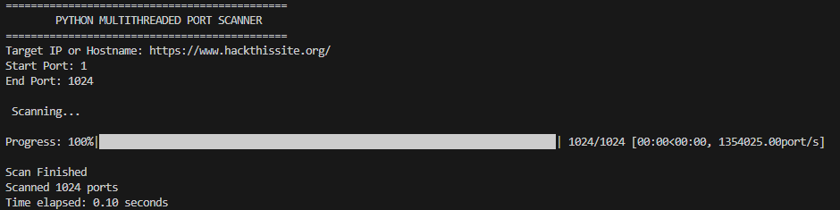
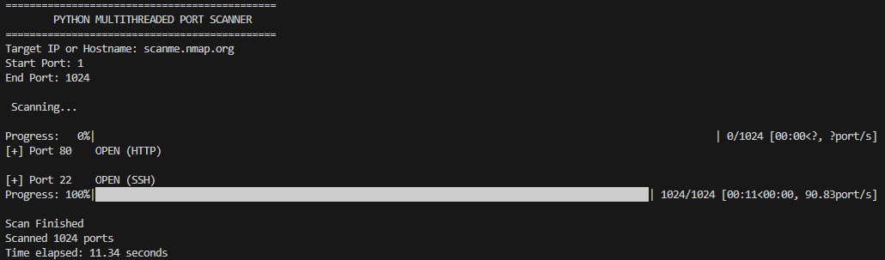

# Python Multithreaded Port Scanner

Um scanner de portas TCP desenvolvido em **Python** que utiliza **multithreading** para realizar scans rápidos e eficientes. A ferramenta permite analisar um intervalo de portas de um determinado host, identificando portas abertas e os serviços associados quando disponíveis.

## Funcionalidades
- Scan de portas TCP.
- Suporte para intervalo de portas personalizado.
- Multithreading para maior desempenho.
- Identificação do serviço associado à porta (quando disponível).
- Barra de progresso durante o scan.
- ⏱️ Mostra o tempo total de execução.

---

## 🛠️ Tecnologias Utilizadas

- Python 3
- Socket
- ThreadPoolExecutor
- tqdm

---

## 📋 Requisitos

- Python 3.8 ou superior

Instalar dependências:

```bash
pip install tqdm
```

## 🚀 Como Executar

Clonar o repositório:

```bash
git clone https://github.com/Vasco-Venix/Python-Port-Scanner.git
```

Entrar na pasta:

```bash
cd pyProjects
```

Executar:

```bash
python3 portScanner.py
```

---

## 📸 Screenshots

<p align="center">
  
</p>

<p align="center">
  
</p>

---
